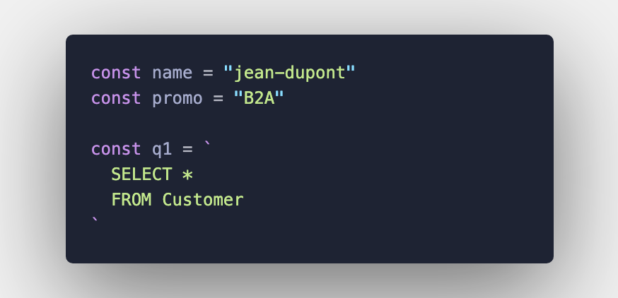

# B2 2020 - TP SQL numéro 1 

Pour ce TP, vous devrez au préalable avoir installé SQL SERVER, ainsi que la base de données Chinook.

Le fichier de génération de la base se trouve [ici](/Chinook.sql), et schéma [là](images/chinook-scheme.png).

Vous trouverez la liste des des requetes a executer [ici](/TP1-Questions.md).

Lire attentivement la section suivante !

**Pour remettre ce TP vous devrez:**

  - Créer un repo sur git (Gitlab YNOV conseillé) ou fork celui-ci

  - Copier le fichier rendu.js dans le repo

  - Le renommer par votre prenom-nom, exemple jean-dupont.js 

  - Dans ce fichier, remplacer le nom et la promo par votre nom et votre promo

  - Pour chaque question, mettre votre requete SQL entre les `` au numéro de question correspondant (exemple ci-dessous)

  - Une fois le TP terminé, envoyez le lien de votre repo via le formulaire https://forms.gle/Z6JvoekeMDBRkWzUA
    
  - Pensez bien à partager votre repo avec moi (ID: @154494 sur gitlab YNOV) ou à rendre votre repo public
    
      
      
      

**ATTENTION la correction de ce TP est automatique, faites donc tres attention a :**

  - associer vos requetes a la bonne question
  - bien ecrire votre requete entre `` (back-tick ou accent grave), cela vous permettra de faire des retours a la ligne
  - bien tester vos requetes dans un sgbd avant de repondre
  - ne pas toucher au reste du code dans le fichier js